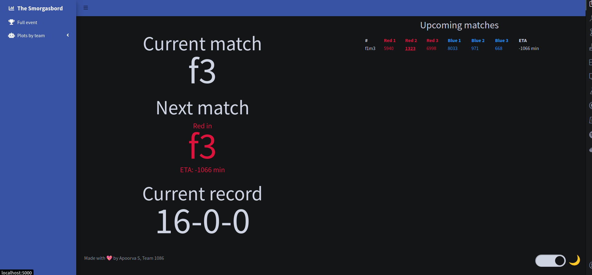
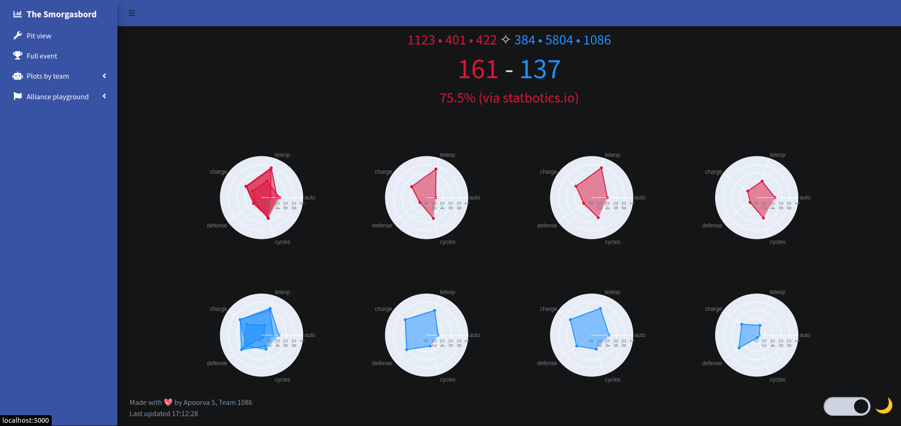
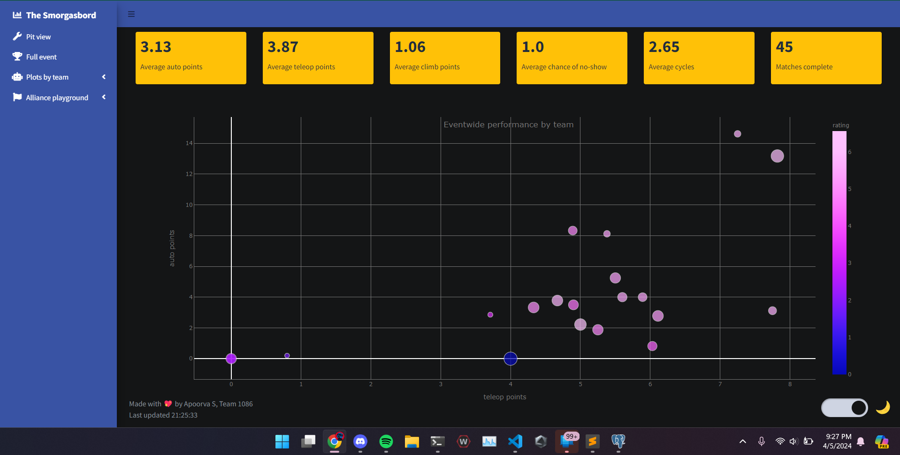

# smorgasbord3

Version 3 of the smorgasbord data scouting dashboard, currently configured for 2024. 

Features:
- realtime pit dashboard with match schedule, record, and predictions
- charts comparing all teams at event
- charts highlighting team performance over time
- match predictions

## Technical info
Takes .json files from scouting app and, upon upload, pushes all data to PostgreSQL database. Designed to be run online as well as locally due to restrictions at competition venue. Uses The Blue Alliance API for match schedule and Statbotics API for match predictions. Built in Flask.

## Screenshots

